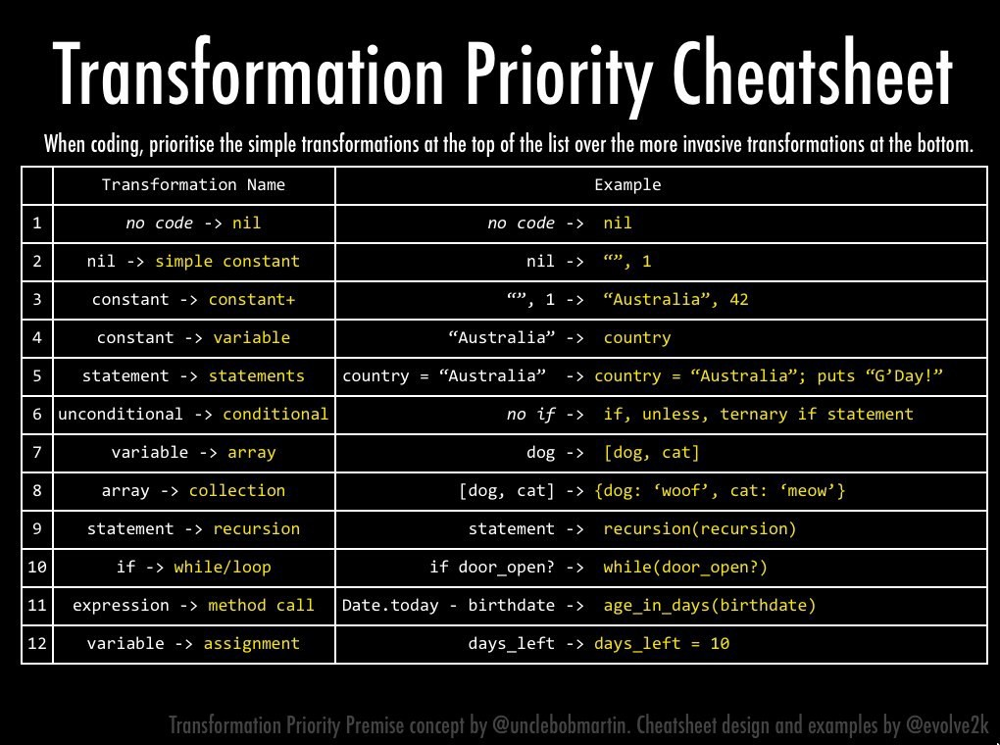
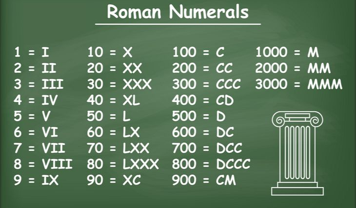
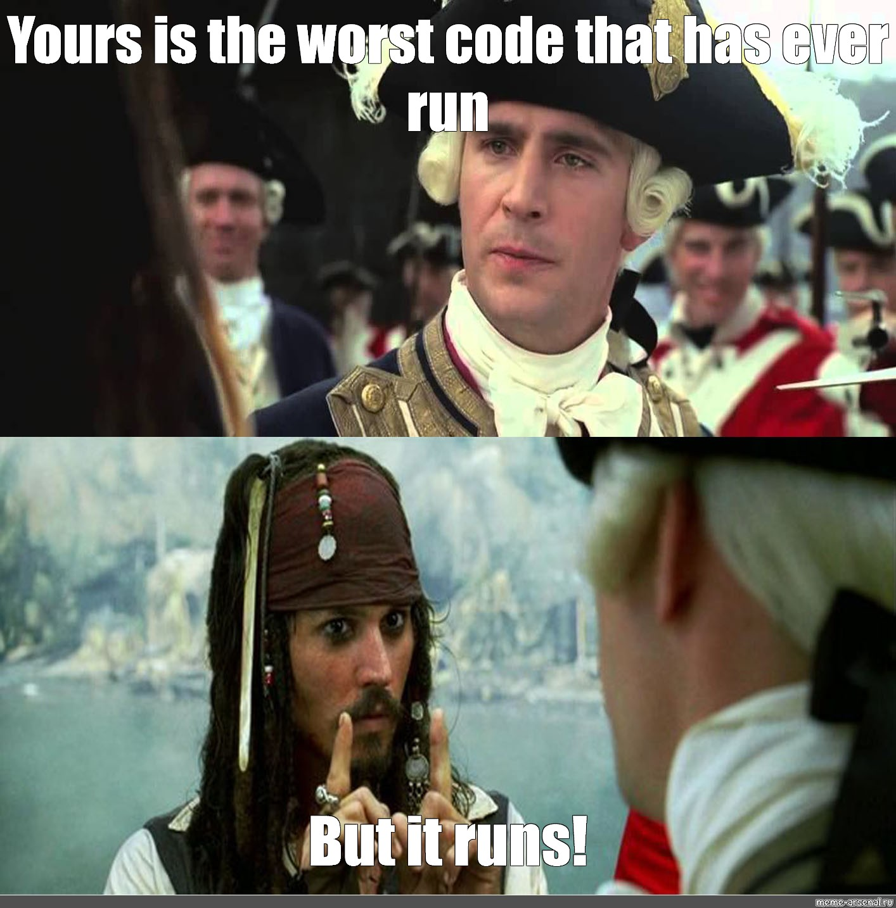

### ¿Qué es el impasse en TDD? ###
El pilar fundamental del desarrollo de software guiado por tests (TDD: [Test Driven Development](https://en.wikipedia.org/wiki/Test-driven_development)) es el ciclo **Red-Green-Refactor**. La premisa es simple: construir la solución al problema haciendo pequeñas iteraciones entre cada una de las fases del ciclo. Es decir:

- **Make it fail**: Escribir un test que falle.
- **Make it run**: Implementar el código de producción mínimo y necesario para pasar el test.
- **Make it right**: Refactorizar esa implementación para eliminar code smells.

TDD nos propone tres opciones para pasar de rojo a verde:

+ **Fake it**: Devolver directamente el resultado esperado en el test.
+ **Obvious implementation**: Implementar la solución más sencilla posible.
+ **Triangulation**: Generalizar la solución únicamente cuando tengamos duplicación.

El problema es que la implementación más obvia no es siempre tan evidente. Que sepamos cómo apilar ladrillos no significa que podamos hacer una casa.

 

En algún momento nos veremos obligados a tomar una decisión algorítmica que va a **cambiar el comportamiento** de nuestro código. Estas modificaciones que implican cambio de comportamiento se llaman **transformaciones**, en contraposición con los cambios en la estructura del código que llamamos **refactors**.

En su definición esencial, TDD no habla de cómo tienen que ser estas transformaciones que nos permiten evolucionar nuestro código hacia soluciones más genéricas. Tan solo nos dice que tienen que ser **implementaciones obvias** que garanticen estar el mínimo tiempo posible en rojo.

Pero sin una guía de cómo avanzar, es muy probable que en algún momento nos planteemos implementar una transformación que nos obligue a cambiar demasiados comportamientos en nuestro código y, en consecuencia, a estar demasiado tiempo en rojo. Esto es lo que se conoce como **impasse** en TDD.

### Transformation Priority Premise

[Robert C. Martin](https://en.wikipedia.org/wiki/Robert_C._Martin) estaba intentando atacar este problema cuando encontró cierta lógica, o mejor dicho, cierto **orden en las transformaciones** que a menudo aplicamos a nuestro código para pasar de soluciones simples a soluciones más genéricas. Allá por el 2010, publicó [una guía](https://blog.cleancoder.com/uncle-bob/2013/05/27/TheTransformationPriorityPremise.html) ordenada de transformaciones a la que bautizó como **Transformation Priority Premise** (TPP).



Lo que plantea TPP no es otra cosa que un orden concreto a la hora de saltar de unas estructuras de datos (o sentencias) a otras. 

La idea es ir evolucionando nuestro código en pequeños pasos ordenados que garanticen que hacemos TDD usando siempre la implementación más obvia y manteniéndonos el **mínimo tiempo posible en rojo**.

La prioridad de las transformaciones **no es arbitraria**. Las transformaciones que están más arriba en la tabla corresponden a estructuras de datos y sentencias más simples que son capaces de resolver problemas más específicos. A medida que bajamos en la tabla de transformaciones, aumenta la complejidad, pero también la capacidad de resolver problemas más genéricos.

Es por ello que Robert C. Martin hace hincapié en la importancia de priorizar las transformaciones que están **más arriba** en la tabla, tanto en el momento de escribir los tests, como en el de implementar la solución.

Aunque en algunos casos la siguiente transformación en la lista no parezca que pueda resolvernos el problema, es mejor probarla a ir saltándose el orden de prioridad establecido.

### Roman Numerals Kata usando TPP


Para ver cómo funcionan estas transformaciones, vamos a hacer la **Roman Numerals Kata** usando TPP. El objetivo de esta kata es conseguir un conversor de números enteros (o arábigos) a números romanos (string). 

Para empezar, hemos escrito un único **test parametrizado** que nos va a permitir ir añadiendo cada una de las casuísticas.
```java
@RunWith(JUnitParamsRunner.class)
public class RomanConverterShould {

    @Test
    @Parameters({
            "1, I"
   })
    public void convert_arabic_number_to_roman_numeral(int arabicNumber, String expected) {

        RomanConverter romanConverter = new RomanConverter();
        String romanNumeral = romanConverter.convert(arabicNumber);
        Assert.assertEquals(expected, romanNumeral);

    }
}
```
TPP nos dice que la primera transformación es pasar de no tener código al *null*. Por lo tanto, hacemos que la función devuelva *null* y lanzamos el test, que debería fallar para la primera de las casuísticas (1, “I”).
```java
public class RomanConverter {

    public String convert(int arabicNumber) {
        return null;
    }
}
```
Tenemos el test en rojo, así que ahora debemos aplicar una de las transformaciones de TPP para pasarlo a verde. La siguiente transformación que nos propone es pasar de *null* a una constante. Así que aplicamos el principio *fake it* de TDD y devolvemos exactamente el valor esperado: la constante “I”.
```java
public class RomanConverter {

    public String convert(int arabicNumber) {
        return "I";
    }
}
```
Estamos en verde pero sin duplicación de código, así que de momento obviamos el refactor y escribimos un nuevo test que falle (2, “II”).
```java
@RunWith(JUnitParamsRunner.class)
public class RomanConverterShould {

    @Test
    @Parameters({
            "1, I",
            "2, II"
   })
    public void convert_arabic_number_to_roman_numeral(int arabicNumber, String expected) {

        RomanConverter romanConverter = new RomanConverter();
        String romanNumeral = romanConverter.convert(arabicNumber);
        Assert.assertEquals(expected, romanNumeral);

    }
}
```
Estamos en rojo y, por tanto, tenemos que escribir el suficiente código de producción para pasar a verde. Volvemos a consultar las transformaciones de TPP. Podríamos ir en orden y pasar a la siguiente transformación de la lista **(Constant -> Constant+)**. Si devolvemos la constante compleja “II” conseguimos pasar este último test, pero rompemos el test anterior que espera la respuesta “I”. Esta transformación no nos encaja.
```java
public class RomanConverter {

    public String convert(int arabicNumber) {
        return "II";
    }
}
```
Saltamos a la siguiente transformación **(Constant+ -> Scalar)**. 
```java
public class RomanConverter {

    public String convert(int arabicNumber) {
        String romanNumeral = "I";
        return romanNumeral;
    }
}
```
Vemos que envolver nuestra constante en una variable tampoco nos ayuda a pasar a verde porque el problema es que tenemos una sentencia no condicional y dos casuísticas posibles. Lo que necesitamos es, por tanto, saltar a la transformación número seis de la tabla de transformaciones **(Unconditional -> Conditional)**. 
```java
public class RomanConverter {

    public String convert(int arabicNumber) {
        String romanNumeral = "I";
        if (arabicNumber > 1) romanNumeral += "I";
        return romanNumeral;
    }
}
```
Es importante destacar que estos saltos pueden ocurrir cuando aplicamos TPP. De hecho, la lista no está pensada para que apliquemos siempre todas las transformaciones de manera consecutiva. Lo importante es identificar en qué punto está nuestro código para encontrar la transformación que mejor encaja, priorizando siempre las transformaciones más simples. 

Los saltos entre transformaciones deberían ocurrir cuando la siguiente transformación esté clara y su implementación sea obvia. En caso contrario, se puede ir avanzando paso a paso como hemos hecho más arriba.

Una vez aplicado el condicional nuestro test pasa a verde. Volvemos a escribir una test que falle.
```java
@RunWith(JUnitParamsRunner.class)
public class RomanConverterShould {

    @Test
    @Parameters({
            "1, I",
            "2, II",
            "3, III"
   })
    public void convert_arabic_number_to_roman_numeral(int arabicNumber, String expected) {

        RomanConverter romanConverter = new RomanConverter();
        String romanNumeral = romanConverter.convert(arabicNumber);
        Assert.assertEquals(expected, romanNumeral);

    }
}
```
Podemos volver al verde simplemente añadiendo más condicionales y aplicando la casuística concreta.
```java
public class RomanConverter {

    public String convert(int arabicNumber) {
        String romanNumeral = "I";
        if (arabicNumber > 1) romanNumeral += "I";
        if (arabicNumber > 2) romanNumeral += "I";
        return romanNumeral;
    }
}
```
Sin embargo, ahora si vemos que tenemos duplicación de código y, por tanto, deberíamos refactorizar antes de escribir el siguiente test que falle. TPP también nos puede ayudar en la fase de refactor. 

Si consultamos la tabla, vemos que la siguiente transformación es **(Scalar -> Array)**, así que procedemos a guardar los distintos valores que cubre el test en una array y eso nos permite reducir nuestra lógica a un solo *statement*.
```java
public class RomanConverter {

    String[] romanArray = {"I", "II", "III"};

    public String convert(int arabicNumber) {
        return romanArray[arabicNumber - 1];
    }
}
```
Hemos aplicado TPP, hemos refactorizado el código con una solución más genérica y seguimos en verde.

La mala noticia es que tenemos que volver al rojo porqué aún no hemos acabado toda la funcionalidad esperada de la kata. Escribimos un nuevo test que falle.
```java
@RunWith(JUnitParamsRunner.class)
public class RomanConverterShould {

    @Test
    @Parameters({
            "1, I",
            "2, II",
            "3, III",
            "4, IV"
   })
    public void convert_arabic_number_to_roman_numeral(int arabicNumber, String expected) {

        RomanConverter romanConverter = new RomanConverter();
        String romanNumeral = romanConverter.convert(arabicNumber);
        Assert.assertEquals(expected, romanNumeral);

    }
}
```
Para pasar a verde basta con añadir el "IV" a nuestra array.
```java
public class RomanConverter {

    String[] romanArray = {"I", "II", "III", "IV"};

    public String convert(int arabicNumber) {
        return romanArray[arabicNumber - 1];
    }
}
```
Con esta última implementación nos damos cuenta de que bastaría con seguir añadiendo números romanos a la array para tener el problema resuelto con un solo *statement*. El problema es que si hiciéramos eso, acabaríamos con una array en memoria de **3999 elementos** (tantos como números romanos existen). Aunque es una solución posible, no parece que sea la más óptima. 



Al añadir el "IV" a la array también nos percatamos de que, a pesar de haber eliminado la duplicación de condicionales en nuestro código, seguimos teniendo un elemento que se repite en la array: el símbolo “I”. Este símbolo nos permite formar los números romanos que corresponde al 1, al 2 y al 3. Cualquier refactor orientado a eliminar esta duplicación, sin embargo, nos rompería la lógica de acceder al elemento usando el número arábigo como **índice de la array**.

Parece evidente que tenemos que transformar la array a otra estructura de datos. ¿Qué nos propone TPP como siguiente transformación? Pasar de una array a una colección **(Array -> Collection)**.

Lo haremos en varios pasos. En primer lugar, creamos un diccionario y añadimos todos los elementos que tenemos en la array. Lanzamos el test y  comprobamos que seguimos en verde.
```java
public class RomanConverter {

    Map<Integer, String> romanDict = new LinkedHashMap<>() {{
        put(1, "I");
        put(2, "II");
        put(3, "III");
        put(4, "IV");
    }};
    public String convert(int arabicNumber) {
        return romanDict.get(arabicNumber);
    }
}
```
Ahora mismo hay dos casuísticas posibles: números romanos que son un **símbolo en sí mismo** (por ejemplo, el “I” y el “IV”) y otros números que se forman a partir de la repetición de alguno de esos símbolos (como el “II” y el “III”).  Dos casuísticas pero un solo *statement*. ¿Qué necesitamos? Un condicional (transformación número 6,  **Unconditional -> Conditional**). Aplicamos esta transformación antes de eliminar cualquier elemento del diccionario y nos queda algo así. 
```java
public class RomanConverter {

    Map<Integer, String> romanDict = new LinkedHashMap<>() {{
        put(1, "I");
        put(2, "II");
        put(3, "III");
        put(4, "IV");
    }};
    public String convert(int arabicNumber) {
        if (romanDict.containsKey(arabicNumber)) return romanDict.get(arabicNumber);
        return null;
    }
}
```
Seguimos en verde. 

Ahora es el momento de atacar la duplicación. Después del condicional tenemos un *statement* que debe devolvernos aquellos números romanos que se forman por repetición de otros símbolos. TPP nos propone pasar de un *statement* a una **llamada recursiva** (transformación 9 del cheatsheet). Para hacerlo, eliminamos primero los símbolos “II” y “III” del diccionario. A continuación, indicamos el símbolo que se va a repetir (“I”)  y añadimos la llamada recursiva.
```java
public class RomanConverter {

    Map<Integer, String> romanDict = new LinkedHashMap<>() {{
        put(1, "I");
        put(4, "IV");
    }};
    public String convert(int arabicNumber) {
        if (romanDict.containsKey(arabicNumber)) return romanDict.get(arabicNumber);
        return "I" + this.convert(arabicNumber - 1);
    }
}
```
Ejecutamos de nuevo los tests para comprobar que seguimos en verde.

Llegados a este punto no solo hemos conseguido eliminar duplicación y generalizar la implementación de la solución, además, hemos descubierto el **eje principal** del algoritmo: símbolos únicos y símbolos que se forman por repetición de otros símbolos.
Escribimos un nuevo test que falle. 
```java
@RunWith(JUnitParamsRunner.class)
public class RomanConverterShould {

    @Test
    @Parameters({
            "1, I",
            "2, II",
            "3, III",
            "4, IV",
            "5, V"
   })
    public void convert_arabic_number_to_roman_numeral(int arabicNumber, String expected) {

        RomanConverter romanConverter = new RomanConverter();
        String romanNumeral = romanConverter.convert(arabicNumber);
        Assert.assertEquals(expected, romanNumeral);

    }
}
```
El símbolo que queremos testear ahora (el “V”) cae en la categoría de los símbolos únicos, por tanto, lo añadimos al diccionario y volvemos al verde.
```java
public class RomanConverter {

    Map<Integer, String> romanDict = new LinkedHashMap<>() {{
        put(1, "I");
        put(4, "IV");
        put(5, "V");
    }}; 
    public String convert(int arabicNumber) {
        if (romanDict.containsKey(arabicNumber)) return romanDict.get(arabicNumber);
        return "I" + this.convert(arabicNumber - 1);
    }
}
```
Podemos  hacer lo mismo con el "VI", el "VII" y el "VIII" (añadirlos al test y añadirlos al diccionario). Rápidamente nos damos cuenta de que estamos ante otro caso de números que se forman a partir de la repetición de otros símbolos (en este caso el "V" y el "I"). Así pues, eliminamos esas últimas tres entradas del diccionario y refactorizamos el último *statement* para que ahora pueda gestionar dos casuísticas: la de los símbolos que se repiten empezando con un “I” ("II", "III") y la de los que se repiten empezando con un “V” ("VI", "VII", "VIII").
```java
public class RomanConverter {

    Map<Integer, String> romanDict = new LinkedHashMap<>() {{
        put(1, "I");
        put(4, "IV");
        put(5, "V");
    }};  
    public String convert(int arabicNumber) {
        if (romanDict.containsKey(arabicNumber)) return romanDict.get(arabicNumber);
        if (arabicNumber > 5) return "V" + this.convert(arabicNumber - 5);
        return "I" + this.convert(arabicNumber - 1);
    }
}
```
Añadimos el siguiente caso al test parametrizado (9, “IX”) y volvemos al rojo. Ahora, al añadir un nuevo caso tenemos que preguntarnos a cuál de los dos casuísticas corresponde. En este caso, el "IX" es un símbolo único. Por lo tanto, lo añadimos al diccionario y pasamos al verde. Lo mismo ocurre con el "X". 

Sin embargo, el "XI", "XII" y "XIII" vuelve a ser un caso de números que se forman a partir de la repetición de otros que ya están en el diccionario (“X” y “I”). En consecuencia, los eliminamos del diccionario y añadimos otro condicional para cubrir todos los casos que se formen con la “X” como primer símbolo.
```java
public class RomanConverter {

    Map<Integer, String> romanDict = new LinkedHashMap<>() {{
        put(1, "I");
        put(4, "IV");
        put(5, "V");
        put(9, "IX");
        put(10, "X");
    }};
    public String convert(int arabicNumber) {
        if (romanDict.containsKey(arabicNumber)) return romanDict.get(arabicNumber);
        if (arabicNumber > 10) return "X" + this.convert(arabicNumber - 10);
        if (arabicNumber > 5) return "V" + this.convert(arabicNumber - 5);
        return "I" + this.convert(arabicNumber - 1);
    }
}
```
Gracias a esta implementación volvemos al verde. Lo curioso es que ahora tenemos cubiertos todos los números del 1 al 39, porque todos se forman repitiendo los símbolos anteriores. 

El siguiente nuevo símbolo entra precisamente con el número 40 ("XL"). Repetimos el proceso. Primero, añadimos el nuevo parámetro al test para que falle.
```java
@RunWith(JUnitParamsRunner.class)
public class RomanConverterShould {

    @Test
    @Parameters({
            "1, I",
            "2, II",
            "3, III",
            "4, IV",
            "5, V",
            "6, VI",
            "7, VII",
            "8, VIII",
            "9, IX",
            "10, X",
            "11, XI",
            "12, XII",
            "13, XIII",
            "40, XL"
   })
    public void convert_arabic_number_to_roman_numeral(int arabicNumber, String expected) {

        RomanConverter romanConverter = new RomanConverter();
        String romanNumeral = romanConverter.convert(arabicNumber);
        Assert.assertEquals(expected, romanNumeral);

    }
}
```
A continuación, y al tratarse el 40 de un símbolo único ("XL"), lo añadimos al diccionario y volvemos al verde.
```java
public class RomanConverter {

    Map<Integer, String> romanDict = new LinkedHashMap<>() {{
        put(1, "I");
        put(4, "IV");
        put(5, "V");
        put(9, "IX");
        put(10, "X");
        put(40, "XL");
    }}; 
    public String convert(int arabicNumber) {
        if (romanDict.containsKey(arabicNumber)) return romanDict.get(arabicNumber);
        if (arabicNumber > 10) return "X" + this.convert(arabicNumber - 10);
        if (arabicNumber > 5) return "V" + this.convert(arabicNumber - 5);
        return "I" + this.convert(arabicNumber - 1);
    }
}
```
El caso del 41 (XLI) y los siguientes (hasta llega al próximo símbolo único, el 50 o "L") cumple con la segunda casuística, la de los números que se forman por repetición de otro (en este caso, empezando por "XL"). Así pues, añadimos el parámetro al test, luego el condicional al código y volvemos al verde.
```java
public class RomanConverter {

    Map<Integer, String> romanDict = new LinkedHashMap<>() {{
        put(1, "I");
        put(4, "IV");
        put(5, "V");
        put(9, "IX");
        put(10, "X");
        put(40, "XL");
    }}; 
    public String convert(int arabicNumber) {
        if (romanDict.containsKey(arabicNumber)) return romanDict.get(arabicNumber);
        if (arabicNumber > 40) return "XL" + this.convert(arabicNumber - 40);
        if (arabicNumber > 10) return "X" + this.convert(arabicNumber - 10);
        if (arabicNumber > 5) return "V" + this.convert(arabicNumber - 5);
        return "I" + this.convert(arabicNumber - 1);
    }
}
```
Llegados a este punto volvemos a tener suficiente duplicación en el código como para intentar un refactor. Para ello, consultamos el listado de TPP. Tenemos duplicación de condicionales y, la transformación que TPP nos propone es pasar de un **IF a un LOOP**. De momento, solo cambiamos los condicionales repetidos por claúsulas WHILE. Para ello, debemos quitar los **return** e ir acumulando el resultado en una variable de tipo string que llamaremos **romanNumeral**. Esto nos obligará a crear un while para cada uno de las entradas del diccionario.
```java
public class RomanConverter {
    Map<Integer, String> romanDict = new LinkedHashMap<>() {{
        put(1, "I");
        put(4, "IV");
        put(5, "V");
        put(9, "IX");
        put(10, "X");
        put(40, "XL");
    }};

    public String convert(int arabicNumber) {
        String romanNumeral = "";
        while (arabicNumber >= 40) {
            romanNumeral += "XL";
            arabicNumber -= 40;
        }
        while (arabicNumber >= 10) {
            romanNumeral += "X";
            arabicNumber -= 10;
        }
        while (arabicNumber >= 9) {
            romanNumeral += "IX";
            arabicNumber -= 9;
        }
        while (arabicNumber >= 5) {
            romanNumeral += "V";
            arabicNumber -= 5;
        }
        while (arabicNumber >= 4) {
            romanNumeral += "IV";
            arabicNumber -= 4;
        }
        while (arabicNumber >= 1) {
            romanNumeral += "I";
            arabicNumber -= 1;
        }
        return romanNumeral;
    }
}
```
Ejecutamos los tests y... ¡verde!

¿Qué ha pasado aquí? Hemos conseguido eliminar la duplicación de IF y ahora tenemos duplicación de WHILE (incluso más que antes). Pero gracias a este cambio que nos proponía TPP ahora vemos cierta lógica que antes no era tan evidente. Al final, lo que estamos haciendo  es una claúsula WHILE por cada uno de los elementos que tenemos en el diccionario. Es decir, lo que tenemos que hacer es **recorrer el diccionario**, pero no manualmente como estamos haciendo aquí, sino con un loop. Seguimos con el refactor antes de escribir un nuevo test que falle.
```java
public class RomanConverter {
    Map<Integer, String> romanDict = new LinkedHashMap<>() {{
        put(1, "I");
        put(4, "IV");
        put(5, "V");
        put(9, "IX");
        put(10, "X");
        put(40, "XL");
    }};

    public String convert(int arabicNumber) {
        String romanNumeral = "";
        for(int dictKey : romanDict.keySet()) {
            while (arabicNumber >= dictKey) {
                romanNumeral += romanDict.get(dictKey);
                arabicNumber -= dictKey;
            }
        }
        return romanNumeral;
    }
}
```
Si lanzamos los tests con este código tal y como lo tenemos, volveremos al rojo. ¿Por qué? Hemos podido eliminar la duplicación de bucles WHILE al introducir el FOR que recorre todo el diccionario, pero hemos pasado por alto un pequeño detalle. En el paso anterior ibamos recorriendo manualmente cada uno de los símbolos de mayor a menor, pero al hacerlo automáticamente con un bucle FOR, el orden es el inverso. Basta con darle la vuelta al diccionario para mantenernos en verde.
```java
public class RomanConverter {
    Map<Integer, String> romanDict = new LinkedHashMap<>() {{
        put(40, "XL");
        put(10, "X");
        put(9, "IX");
        put(5, "V");
        put(4, "IV");
        put(1, "I");
    }};

    public String convert(int arabicNumber) {
        String romanNumeral = "";
        for(int dictKey : romanDict.keySet()) {
            while (arabicNumber >= dictKey) {
                romanNumeral += romanDict.get(dictKey);
                arabicNumber -= dictKey;
            }
        }
        return romanNumeral;
    }
}
```
¡Lo tenemos! Este código debería bastar para cubrir todos los casos posibles. Lo único que necesitamos es completar el diccionario con todos los símbolos romanos únicos:
```java
public class RomanConverter {
    Map<Integer, String> romanDict = new LinkedHashMap<>() {{
        put(1000, "M");
        put(900, "CM");
        put(400, "CD");
        put(100, "C");
        put(90, "XC");
        put(50, "L");
        put(40, "XL");
        put(10, "X");
        put(9, "IX");
        put(5, "V");
        put(4, "IV");
        put(1, "I");
    }};

    public String convert(int arabicNumber) {
        String romanNumeral = "";
        for(int dictKey : romanDict.keySet()) {
            while (arabicNumber >= dictKey) {
                romanNumeral += romanDict.get(dictKey);
                arabicNumber -= dictKey;
            }
        }
        return romanNumeral;
    }
}
```
### Conclusion
Con esta sencilla kata hemos podido ver que al aplicar las transformaciones que propone TPP conseguimos garantizar:
- Mínimo tiempo en rojo (evitar el impasse)
- Descubrimiento de los ejes del problema
- Solución más genérica y con menos duplicación

TPP es una de las herramientas de las que disponemos para garantizar el ajuste a los preceptos del desarrollo guiado por tests. Este listado de transformaciones no contiene reglas escritas en piedra, pero si son una pequeña guía para evitar el bloqueo en el ciclo de TDD, especialmente al pasar de rojo a verde.


 

